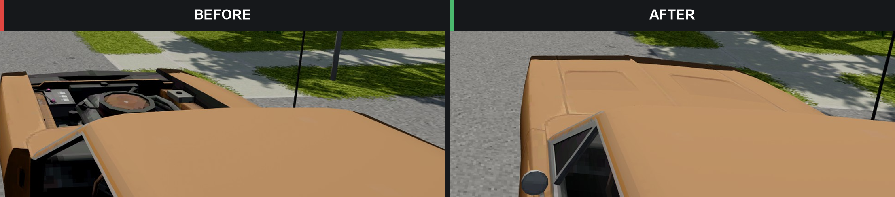
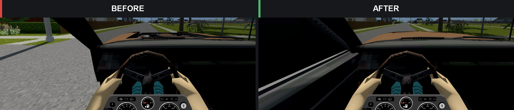

# Project Viewpoint - KI5 Vehicle Parts Fix

Version **1.1**. A client-side patch for disappearing KI5 vehicle parts near the edges of the camera in Project Viewpoint.




## Requirements

- Project Zomboid 42.21 or later. Tested on 42.21; future compatibility depends on the game and Viewpoint renderer.
- [Project Viewpoint](https://steamcommunity.com/sharedfiles/filedetails/?id=3809306528), tested with 0.1.5a-hotfix.
- [ZombieBuddy](https://steamcommunity.com/sharedfiles/filedetails/?id=3619862853), version 2.3.0 or later.
- Your vehicle mods and their dependencies.

Enable the patch after Viewpoint and restart the game. Approve its Java component in ZombieBuddy if prompted. Mod ID: `ProjectViewpointKI5VehiclePartsFix`.

## How it works

The patch hooks `ModelPass.shown` and only processes rejected `VehicleSubModelInstance` parts. Nearby parts use a visibility workaround; distant parts receive an expanded sphere test. Already visible parts return immediately. There are no settings or per-frame log counters. Original mod files are untouched.

The near radius is 12 and the additional sphere radius is 4 in Viewpoint render coordinates. If the renderer layout is incompatible, the patch falls back to original behaviour and logs the failure.

This patch addresses part visibility. Long vehicles and trailers need additional visual testing. FPS gains, multiplayer and Tsar-specific vehicles have not been verified.

## Build and test

Install JDK 25 and put its tools on PATH. Dependencies are read from your own installation and are not distributed here.

```powershell
./source/build.ps1 -GameDir '<ProjectZomboid directory>' -ViewpointJar '<path to Viewpoint.jar>' -Test
```

The command builds `build/ViewpointVehiclePartsGuard.jar` and runs the guard checks and ByteBuddy binding check. These offline checks do not replace in-game testing.

For development, replace the JAR in your local patch folder at `42/media/java/client/ViewpointVehiclePartsGuard.jar` with the built JAR. Copy source/lua/client/VPVParts_PorscheRoof.lua into 42/media/lua/client/ in the same mod folder. Enable the mod in your save and fully restart the game. Do not enable local and Workshop copies at the same time.

## Source layout

- `source/vpvparts`: Java entry point, renderer hook and visibility guard.
- `source/lua/client`: Porsche Turbo interior roof compatibility fix.
- `source/GuardHarness.java`: guard behaviour checks.
- `source/AdviceHarness.java`: offline hook binding check.


## Removal

Disable the patch and fully restart the game, then unsubscribe or remove the local copy. No save changes need reverting.

## License

Original patch code is available under the [MIT License](LICENSE). This is an independent community patch. KI5, DAMN, Viewpoint, ZombieBuddy and Project Zomboid assets and dependencies retain their respective licenses and are not bundled.

## Update 1.1

Restores the interior roof in the KI5 1982 Porsche 911 Turbo by referencing KI5's existing roof model. No KI5 assets are bundled. The Lua addition must also be enabled for the save; approving the Java component alone only enables the renderer fix. Restart after updating. Verified in game. Other missing surfaces or parts may require separate investigation.
